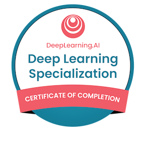
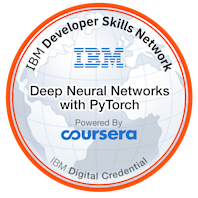

### Hi there 👋
- I am Muhammad Tarek
- I am a computer vision R&D engineer at MCS
- I like working with images, videos 
- I was an ICPC contestant and part of the [ICPC Zagazig University Community](https://www.linkedin.com/company/acmzu/) from 2018 to 2020 as a problem setter and contestant
- I was deep learning and computer vision intern at [Curve A.I solutions](https://curveaisolutions.com/)
- I was an automation engineering intern at [First Gulf Solutions](https://www.firstgulfsolutions.com/)
- I was AI inter at [ODC Egypt](https://www.linkedin.com/company/orange-digital-center-egypt/) cooperated with [Instant software solutions](https://www.linkedin.com/company/instantsoftwaresolution/) 
- I was in the scholarship of intel
 
 

